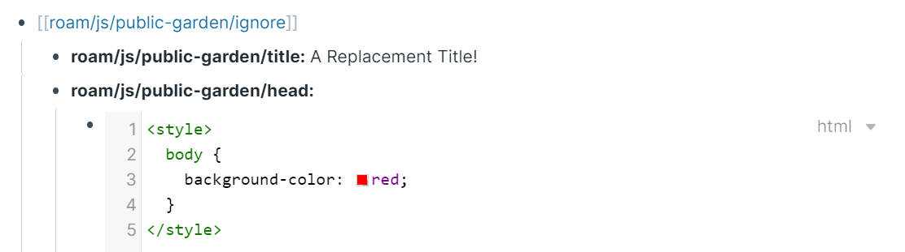

# generate-roam-site

Generate a static site from a Roam Graph.

## Requirements

You must have a version of google chrome installed.

Windows: `C:\Program Files (x86)\Google\Chrome\Application\chrome.exe`

Linux: `/usr/bin/google-chrome-stable`

## Usage

```javascript
import run from "generate-roam-site";

await run({
  roamGraph: "dvargas92495",
  roamUsername: "dvargas92495@gmail.com",
  roamPassword: process.env.ROAM_PASSWORD,
}).then(() => console.log("Success!"));
```

### Roam Configuration

Most other configuration happens from your Roam DB, on a page called `roam/js/static-site`. For legacy reasons, `roam/js/public-garden` is also supported as a valid configuration page name. The following configuration options are supported:

- Index - The page name that will serve as the entry point of the site. Could be raw text or a page link.
- Filter - A set of rules that specifies which pages to build. If a page matches any child rule, it will be built into the site. The following rules are supported:
  - Starts With - If a page starts with the given text, it will be included in the site. Useful for namespacing, e.g. `Article/Article`.
  - Tagged With - If a page contains a tag with the given text, it will be included in the site. Includes pages with any form of tags or attributes. Could be raw text or a page link.
- Template - An HTML Code block that will be used as the template for every generated HTML file.
  - It supports a few variables that can be interpolated:
    - `PAGE_NAME` - The name of the page
    - `PAGE_CONTENT` - The content of the page
    - `REFERENCES` - An array of pages that reference the current page
  - The default template looks like

```html
<!DOCTYPE html>
<html>
  <head>
    <meta charset="utf-8" />
    <title>${PAGE_NAME}</title>
    <style>
      .rm-highlight {
        background-color: hsl(51, 98%, 81%);
        margin: -2px;
        padding: 2px;
      }
    </style>
  </head>
  <body>
    <div id="content">${PAGE_CONTENT}</div>
    <div id="references">
      <ul>
        ${REFERENCES}
      </ul>
    </div>
  </body>
</html>
```

- Reference Template - An HTML Code block that will be used as the template for every page reference. The REFERENCES variable interpolates to all references each rendered as one instance of the template
  - It supports a few variables that can be interpolated:
    - `REFERENCE` - The name of the page referencing the current page
    - `LINK` - The url of the page html file
  - The default template looks like

```html
<li><a href="${LINK}">${REFERENCE}</a></li>
```

Here's an example configuration, that uses the `Personal Website` page as the entry point and includes all pages that start with a `P`:

- Index
  - Personal Website
- Filter
  - Starts With
    - P

Here's an example configuration, that uses the `Blog Post` page as the entry point and includes all pages that are Tagged with `Blog Post`:

- Index
  - Blog Post
- Filter
  - Tagged With
    - Blog Post

### Per Page Configuration

You could ignore specific blocks in pages that are included. Nest everything that you would like to keep on the page but have filtered out of the static site under a block that just says `[[roam/js/static-site/ignore]]`.

You could override any roam page's default title with the `roam/js/static-site/title::` attribute. The value set to the right of this attribute will be used in place of the `PAGE_NAME` variable during template interpolation.

You could add anything to a page's head with the `roam/js/static-site/head::` attribute. The HTML code block defined as a **child** of this block will be injected into this page's head. 



Note, that while you'll usually want to have these attributes nested within the ignore block, it's not a strict requirement.

### Optional Arguments

- `logger` - an object specifying which loggers to use for `info` and `error`. Defaulted to `console`
- `pathRoot` - an absolute file path denoting where output paths should be relative to. Defaulted to `process.cwd()`.
- `inputConfig` - A JSON to override any config options coming from Roam:
    - `index` - `string`
    - `filter` - `{rule: string, values: string[]}[]`
    - `template` - `string`
    - `referenceTemplate` - `string`
